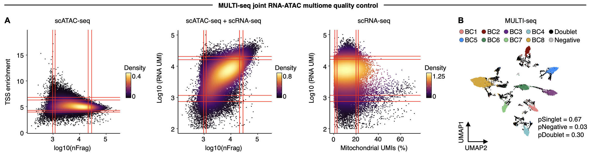
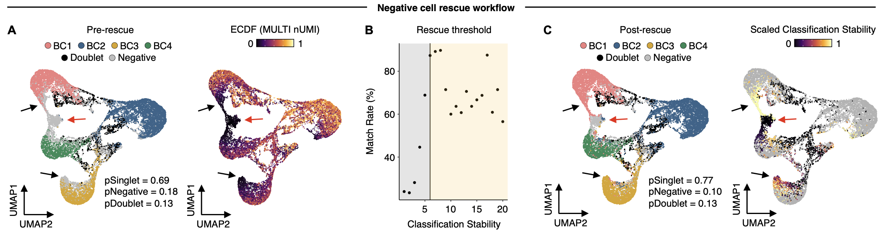
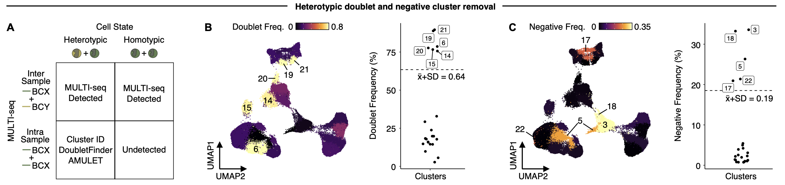
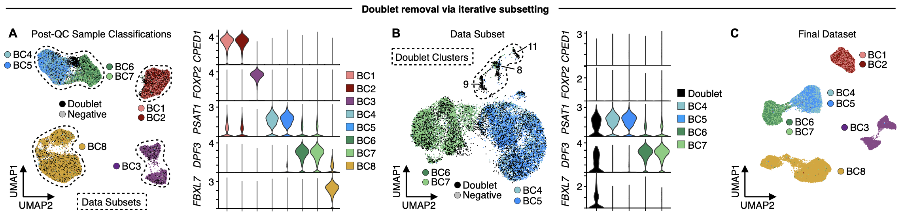

# multi_multiome

Companion code for McGinnis, Conrad, Yao, Satpathy & Gartner (2026). "Sample multiplexing for joint RNA-ATAC multiomic profiling using MULTI-seq." Currently in review at Nature Protocols.

All R objects (including Seurat objects) are available for download at synapse (https://www.synapse.org/Synapse:syn74846733). 
Raw and processed data files are available on GEO (GSE330650). 

Code for visualizations provided in 'multi_multi_viz.R'

Figure 4: MULTI-seq joint RNA-ATAC multiome data quality-control workflow.

Figure 5: MULTI-seq negative cell rescue workflow.

Figure 6: MULTI-seq-informed heterotypic doublet- and negative-enriched cluster removal workflow.

Figure 7: Iterative subsetting workflow for removing remaining heterotypic doublet clusters using MULTI-seq and sample-specific differential expression analysis.

